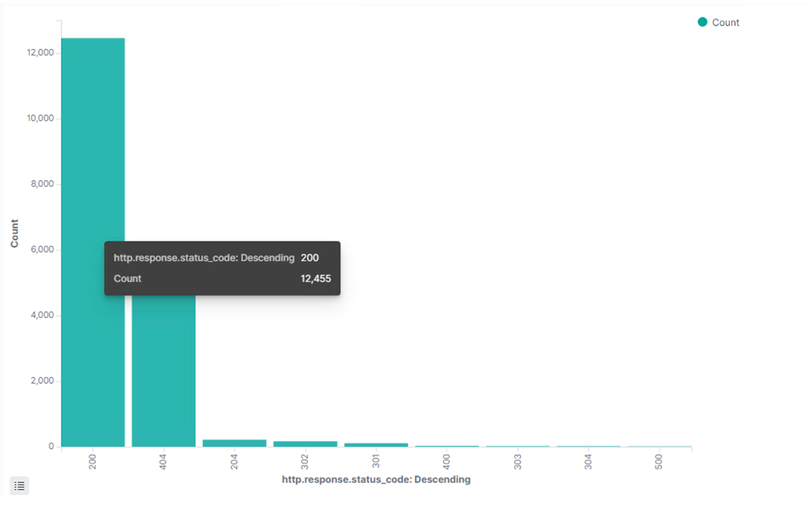
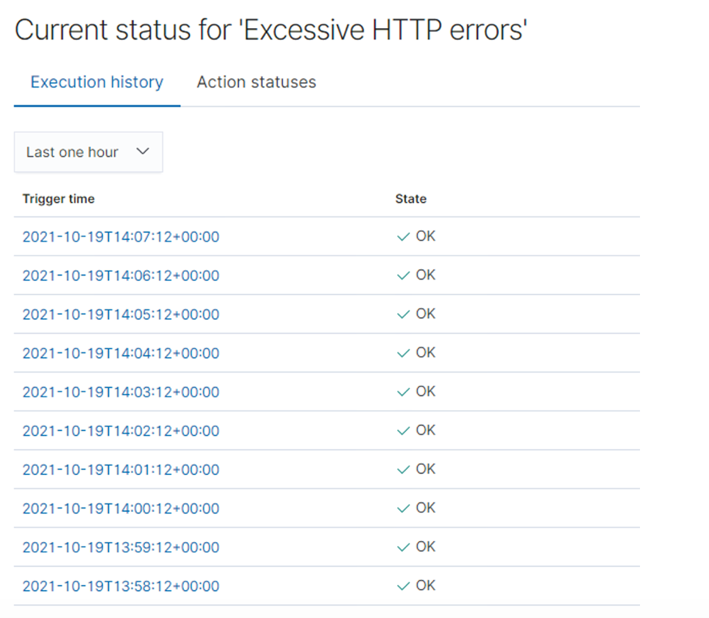
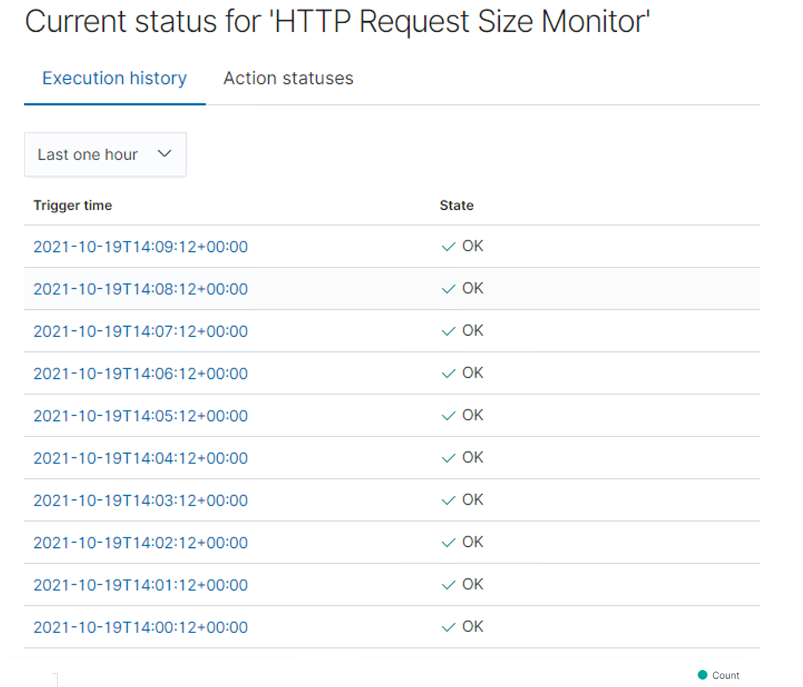
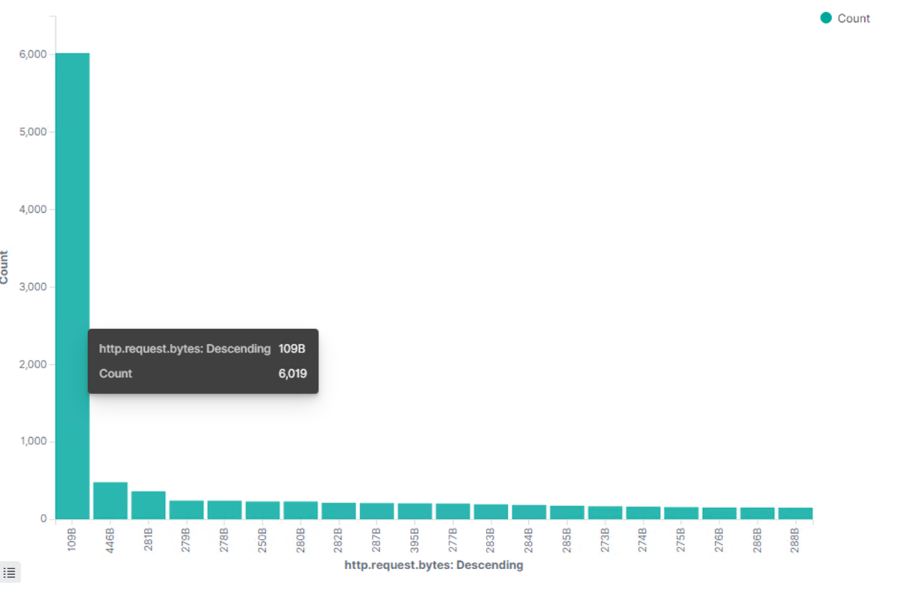
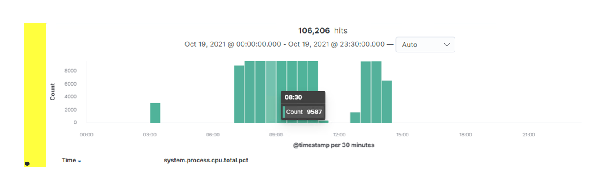
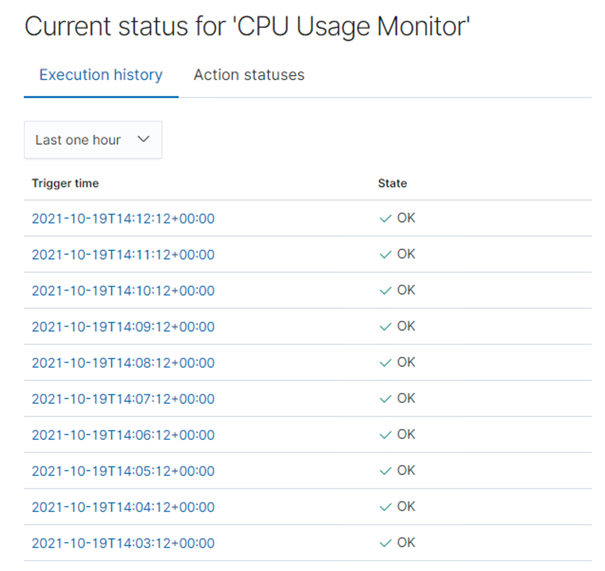

# Blue Team: Summary of Operations #
## Table of Contents ##
  *	Network Topology
  * Description of Targets
  *	Monitoring the Targets
  * Patterns of Traffic & Behavior
  * Suggestions for Going Further

### Network Topology ###

The following machines were identified on the network:

  * Capstone 
  - **Operating System**: Ubuntu 18.04.1
  -	**Purpose**: The Vulnerable Web Server
  -	**IP Address**: 192.168.1.105
  * Kali
  -	**Operating System**: 5.4.0-kali3-amd64
  -	**Purpose**: Pentesting Machine
  -	**IP Address**: 192.168.1.90
  * ELK
  -	**Operating System**: Ubuntu 18.04.4
  -	**Purpose**: The ELK (Elasticsearch and Kibana)  Stack
  -	**IP Address**: 192.168.1.100
  * Target 1
  -	**Operating System**: Limux 3.16.0-6-amd64
  -	**Purpose**: The WordPress Host
  -	**IP Address**: 192.168.1.110

## Description of Targets ##

The target of this attack was: Target 1 (192.168.1.110).

Target 1 is an Apache web server and has SSH enabled, so ports 80 and 22 are possible ports of entry for attackers. As such, the following alerts have been implemented:

### Monitoring the Targets ###

Traffic to these services should be carefully monitored. To this end, we have implemented the alerts below:

**Alert 1: Excessive HTTP Errors**
    
Excessive HTTP Errors is implemented as follows:

WHEN count() GROUPED OVER top 5 'http.response.status_code' IS ABOVE 400 FOR THE LAST 5 minutes 

* **Metric**: WHEN count() GROUPED OVER top 5 ‘http.response.status_code’
* **Threshold**: IS ABOVE 400
* **Vulnerability Mitigated**: Enumeration/Brute Force
* **Reliability**: This alert is reliable. Normal or successful responses will be filtered out by measuring error codes 400 and above (400+ codes are Client and Server Error responses).

  **Alert 2: HTTP Request Size Monitor**
  
HTTP Request Size Monitor is implemented as follows:

WHEN sum() of http.request.bytes OVER all documents IS ABOVE 3500 FOR THE LAST 1 minute 

*	**Metric**: WHEN sum() of http.request.bytes OVER all documents
*	**Threshold**: IS ABOVE 3500 
*	**Vulnerability Mitigated**: Code injection in HTTP requests (XSS and CRLF) or DDoS 
*	**Reliability**: TODO: Does this alert generate lots of false positives/false negatives? Rate as low, medium, or high reliability.

**Alert 3: CPU Usage Monitor**
  
CPU Usage Monitor is implemented as follows:

WHEN max() OF system.process.cpu.total.pct OVER all documents IS ABOVE 0.5 FOR THE LAST 5 minutes 

* **Metric**: WHEN max() OF system.process.cpu.total.pct OVER all documents
*	**Threshold**: IS ABOVE 0.5 FOR THE LAST 5 minutes 
*	**Vulnerability Mitigated**: Malicious software, programs (malware or viruses) running taking up resources
*	**Reliability**: TODO: Does this alert generate lots of false positives/false negatives? Rate as low, medium, or high reliability.

The alert is highly reliable. Even if there isn’t a malicious program running this can still help determine where to improve on CPU usage.

## Suggestions for each vulnerability ##

### Excessive HTTP Errors ###

•	Patch: WordPress Hardening
  - Implement regular updates to WordPress
    -	WordPress Core
    -	PHP version
    -	Plugins
  -	Install security plugin(s)
    -	Ex. Wordfence (adds security functionality)
  -	Disable unused WordPress features and settings like:
    -	WordPress XML-RPC (on by default)
    -	WordPress REST API (on by default)
  -	Block requests to /?author= by configuring web server settings
  -	Remove WordPress logins from being publicly accessible specifically:
    -	/wp-admin
    -	/wp-login.php

•	Why It Works:
  -	Regular updates to WordPress, the PHP version and plugins is an easy way to implement patches or fixes to exploits/vulnerabilities.
  -	Depending on the WordPress security plugin it can provide things like:
    -	Malware scans
    -	Firewall
    -	IP options (to monitor/block suspicious traffic)
  -	REST API is used by WPScan to enumerate users
    -	Disabling it will help mitigate WPScan or enumeration in general
  -	XML-RPC uses HTTP as it’s method of data transport
  -	WordPress links (permalinks) can include authors (users)
    -	Blocking request to view the all authors (users) helps mitigate against user enumeration attacks
  -	Removal of public access to WordPress login helps reduce the attack surface

### HTTP Request Size Monitor ###

•	Patch: Code Injection/DDOS Hardening
  -	Implementation of HTTP Request Limit on the web server
    -	Limits can include a number of things:
    -	Maximum URL Length  
    -	Maximum length of a query string
    -	Maximum size of a request
  -	Implementation of input validation on forms
•	Why It Works:
  -	If an HTTP request URL length, query string and over size limit of the request a 404 range of errors will occur.
    -	This will help reject these requests that are too large.
  -	Input validation can help protect against malicious data anyone attempts to send to the server via the website or application in/across a HTTP request.

### CPU Usage Monitor ###

•	Patch: Virus or Malware hardening
  -	Add or update to a good antivirus.
  -	Implement and configure Host Based Intrusion Detection System (HIDS)
    -	Ex. SNORT (HIDS)
•	Why It Works:
  -	Antiviruses specialize in removal, detection and overall prevention of malicious threats against computers.
    -	Any modern antivirus usually covers more than viruses and are a robust solution to protecting a computer in general.
  -	HIDS monitors and analyzes internals of computing systems.
    -	They also monitor and analyze network packets.
